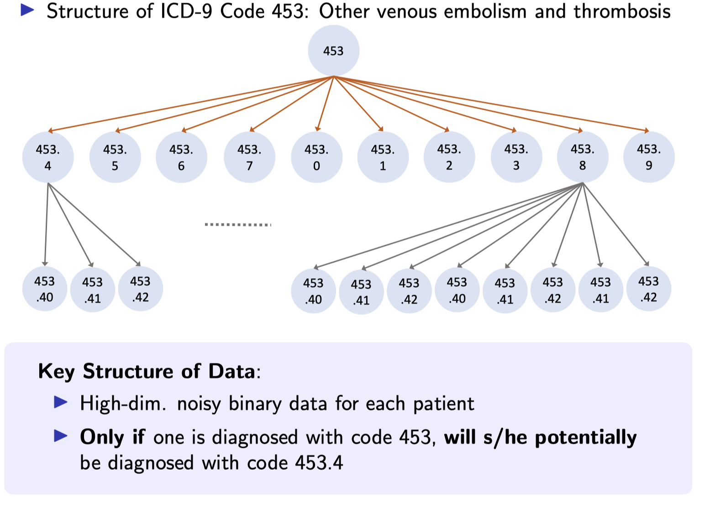
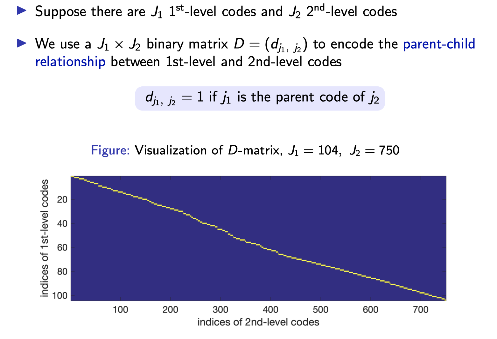
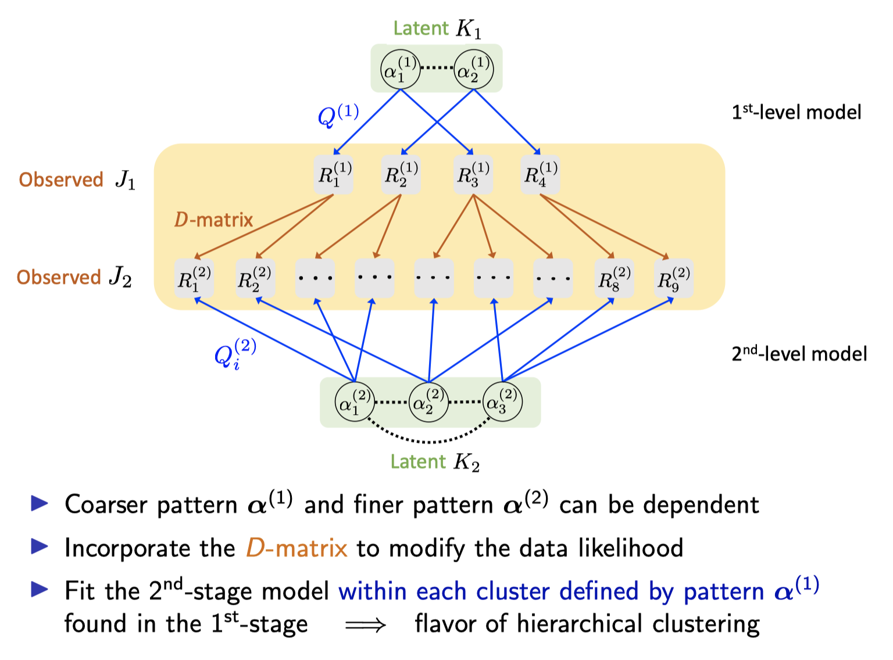

**slamR**: **S**tructured **L**atent **A**ttribute **M**odels in **R**

An R package for Structured Latent Attribute Models (SLAM)

zhenkewu badges:
[](https://travis-ci.org/zhenkewu/slamR)
[](https://ci.appveyor.com/project/zhenkewu/slamR)

**Maintainer**: Zhenke Wu, zhenkewu@umich.edu

**References**: If you are using **slamR** for clustering multivariate binary
observations with SLAM, please cite the following papers:

|       | Citation     | Paper Link
| -------------  | -------------  | -------------  |
| SLAM - multilevel latent attributes and multilevel tree-structured responses, unknown Q | Gu Y, Li M, Xu G, Wu Z (2020+). Interpretable Clustering of Hierarchical Dependent Binary Data: A Doubly-Multi-Resolution Approach. In progress. | [link]()|
| SLAM - known Q    | Gu Y and Xu G (2019). Learning attribute patterns in high-dimensional structured latent attribute models. *Journal of Machine Learning Research* 20.115: 1-58   |[Link](http://jmlr.org/papers/v20/19-197.html)| 
| SLAM - hierarchical attributes, unknown Q | Gu Y and Xu G (2019). Identification and Estimation of Hierarchical Latent Attribute Models. arXiv:1906.07869| [link](https://arxiv.org/abs/1906.07869)|


## Table of content
- [1. Installation](#id-section1)
- [2. Overview](#id-section2)
- [2. Example](#id-section3)

<div id='id-section1'/>

Installation
--------------
```r
install.packages("devtools",repos="https://cloud.r-project.org")
devtools::install_github("zhenkewu/slamR")
```
<div id='id-section2'/>

Overview
----------
Structured latent attribute models (SLAMs) are a special family of discrete latent variable models widely used in social and biological sciences. This paper considers the problem of learning significant attribute patterns from a SLAM with potentially high-dimensional configurations of the latent attributes. We address the theoretical identifiability issue, propose a penalized likelihood method for the selection of the attribute patterns, and further establish the selection consistency in such an overfitted SLAM with a diverging number of latent patterns. The good performance of the proposed methodology is illustrated by simulation studies and two real datasets in educational assessments.

**slamR** works for 

* one-level binary responses
	-  known Q, unknown attribute set
    -  unknown Q, unknown attribute set
* two-level binary responses
	-  unknown or known Q, unknown attribute sets at both levels


<div id='id-section3'/>

Examples (two-level binary responses)
---------

- 1. Example code to use `slamR` is at [`inst/example/compare_flat.R`](inst/example/compare_flat.R)

- 2. restricted latent class analysis with **pre-specified # of factors** but unknown # of clusters

* Example of the Tree Structure of Observed ICD-9 Codes


* Incorporate tree structure


* doubly-multi-resolution approach for dealing with two-level multivariate binary data



